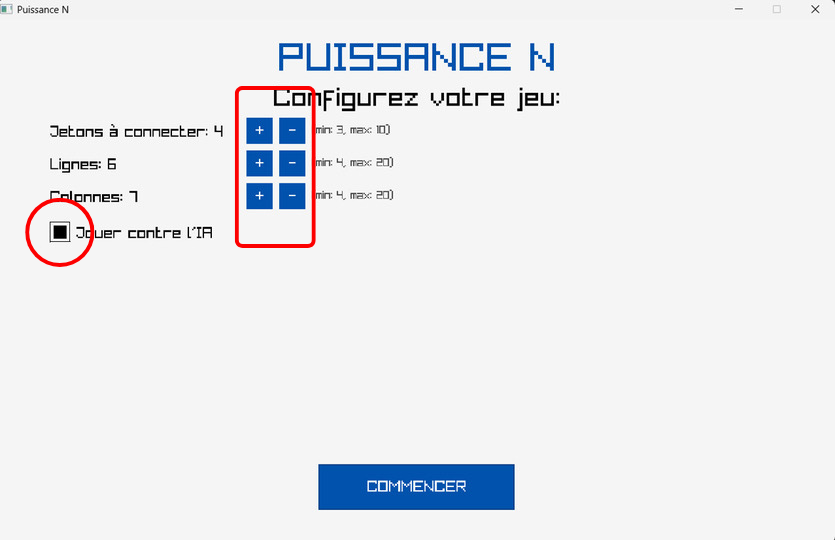

# Puissance N

Bienvenue sur la page git de notre jeu Puissance N !  
Vous y trouverez un petit mode d'emploi et un guide d'installation vous permettant de lancer le jeu correctement.

# Principe du jeu

Le principe du jeu est le même que le bien connu jeu du Puissance 4, à la seule différence que vous pouvez réglez vos propres paramètres : nombre de lignes, nombre de colonnes et nombre de jetons à aligner pour pouvoir gagner (appuyez sur les boutons + et - pour régler).  
De plus, vous pouvez choisir de jouer avec un ami ou bien contre votre ordinateur. Pour cela, Il vous suffit de cocher (ou non) la case "Jouer contre l'IA" sur la page d'accueil.

  

Quand vous êtes prêt, cliquez sur Commencer !  
Si vous jouez contre votre ordinateur, c'est vous qui commencez. Cliquez sur la colonne de votre choix pour y mettre un jeton.  

# Guide d'installation 

Mais avant cela, il faut tout d'abord lancer le jeu. Comment faire ?

Vous trouverez sur cette page tous les fichiers nécessaires au bon déroulement du jeu. 
Suivez les étapes suivantes : 

  1. Téléchargez les fichiers sur votre PC, stockez les dans un dossier à part puis importez les dans VScode
  2. Téléchargez la bibliothèque Raylib sur votre PC
  3. Dans le MakeFile fourni (CMakeLists.txt), corrigez le chemin permettant d'accéder à la bibliothèque Raylib en fonction d'où vous l'avez enregistrée sur votre PC. Corrigez également le nom de l'éxécutable (ici ConnectN) en fonction du nom de votre projet VScode.
     

  

     
  4. Exécutez  

Vous devriez normalement être face à la page d'acceuil de notre jeu. Comme expliqué ci-dessus, réglez vos paramètres comme vous le souhaitez et cliquez sur Commencer.  
Si un quelconque problème ne vous permet pas de lancer le jeu, n'hésitez pas à nous contacter.
